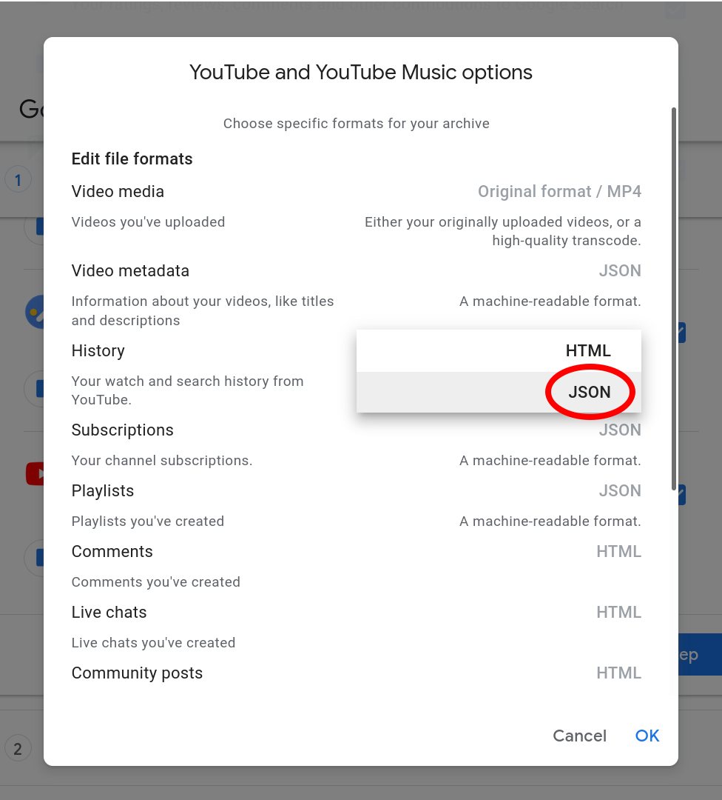

Youtube Time Tracking
======================

Script to compute stats on how much time you watched Youtube, aggregated by day and channel name.

The output is a CSV file, which will look like this:
```
Day,TOTAL,YUYUの日本語Podcast,マコなり社長,Teppei,Nihongo SWiTCH
2021-07-29,36,20,,16,
2021-07-30,52,20,18,,14
2021-07-31,0,,,,
```

Usage
------

**IMPORTANT**: To use this, you first need go to extract "YouTube and YouTube Music" data for your account.

Go to https://takeout.google.com, click on "Deselect all".


Scroll down to find the "YouTube and YouTube Music" section.
Add it to the export by ticking the box, then click on "Multiple formats".


For "History" entry, make sure you select "JSON" instead of the default "HTML".



Then follow the instructions to download a ZIP file with your data.

Extract the zip file, it should contain the file `takeout/YouTube and YouTube Music/history/watch-history.json`
which you will give to the program.

Go the [release page](https://github.com/itsupera/youtube_time_tracking/releases)
and grab the latest version for your platform.

Run it and follow the instructions to get your CSV file !

Setup
------

To setup the project from sources and build the executables,
here are the instructions for Ubuntu Linux (should work on other platforms supporting Python):

```bash
sudo apt install python3-virtualenv
virtualenv venv
source venv/bin/activate
pip3 install ".[cx_freeze]"
python3 -m yttt.gui
```

To build a standalone executable:
```bash
python3 cx_freeze_setup.py build_exe
./build/exe.linux-x86_64-3.8/yttt
```